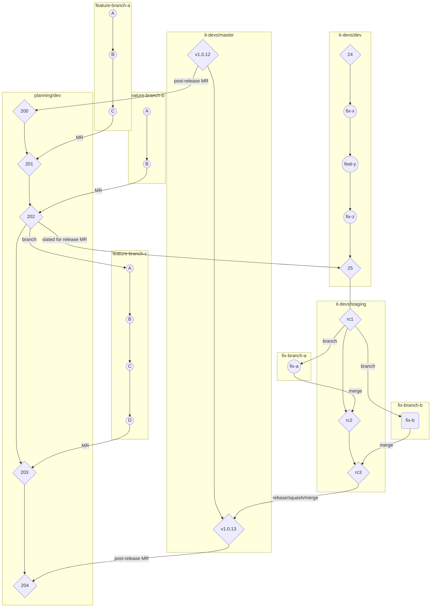

# Table of Contents

[[_TOC_]]

# Getting Started
Work with someone on the data team to clone the `dany_dashboard` Gitlab repository into your `P:\User Data` folder using the SSH option, if possible. [https://gitlab.dany.nycnet/Planning/dany_dashboard/](https://gitlab.dany.nycnet/Planning/dany_dashboard/).


# Project Structure

* [app](app/) is the Shiny application's main folder. Contains [app.R](app/app.R).
  * [data_refresh/](app/data_refresh/) contains code to refreshing data used to run the application, and SQL code used for the tables on PLANINTDB. See [Refresh of RDS files](#refresh-of-rds-files) for information on the data refresh.
  * [app.R](app/app.R) contains the code to run the application.
  * [website/](app/website/)
    * [global.R](app/global.R) contains variables used throughout the Shiny application.
    * [globalParts.R](app/globalParts.R) contains user interface parts used throughout the Shiny application. 
    * [ui.R](app/website/ui.R) contains the Shiny application user interface definition.
    * [server.R](app/website/server.R) contains the Shiny application server definition.
  * [www/](app/www/) The `www` directory is the directory expected by a Shiny application to locally store the elements that will be rendered in the web browser and are not the output of the scripts. This includes images, HTML, .js files, and so on. This directory must be in `app`, the Shiny application's main folder.
* [wip](wip/) contains code that are considered works in progress.
* `Makefile` is used for deploying the application on the development server.
* several `docker-compose.yml` files which define how to set up the development servers; these are used by the `Makefile`.

### Data
When the dany_dashboard application is run, all dashboard data gets imported from the RDS files in [app/website/data](app/website/data/) and saved into variables in [app/website/global.R](app/website/global.R) and [app/website/globalParts.R](app/website/globalParts.R). Because the files `global.R` and `globalParts.R` are sourced once at the onset of the application in [app/app.R](app/app.R), the dashboard data variables are available to all dashboards. 


# Contributing
Contributions to the project are done through Gitlab.

## Git practices
#### ***Topic Branches***  
Topic branches should have the following style:  
`initials-month-day-brief-description`

#### ***Commits***  
Commits should have the following style:  
`(topic) Capitalized sentence with info followed by period.`  
If your commit is long, it should be  
  ```
  (topic) Capitlized sentence with info followed by period.

  * Bullet point 1 with period.
  * Bullet point 2 with period.
  ```

#### ***Merge requests (MRs)***  
Merge requests (MRs) are the way you check source code changes into a branch. To read more about `MR`s, visit [Gitlab's documentation on MRs](https://docs.gitlab.com/ee/user/project/merge_requests/getting_started.html), or [Gitlab's documentation on how to create a MR](https://docs.gitlab.com/ee/user/project/merge_requests/creating_merge_requests.html).  When you open a `MR`, you can visualize and collaborate on the code changes before merge. Merge requests include a request title, a description of the request, code changes and inline code reviews, a comment section for discussion threads, and the list of commits.


1. ***Opening a MR***  
  When opening a `MR`, please include the following when filling out the `New Merge Request` page:  
  * `Title` field. A descriptive title. for works in progress (WIP) include WIP in the title.  
  * `Description` field. A brief summary of changes included in the commits.  
  * `Assignee` field. Assign at least one code reviewer.  
  * `Merge options` checkboxes:  
    * Check *Delete source branch when merge request is submitted*  
    * *for feature/fix branches off of `planning/dev` or fix branches off of `it-devs/staging` only* Check *Squash commits when merge request is accepted*  


2. ***Code review on a MR***  
  A "code review" on your code in the `MR` is required from the assignee before it can be merged.  If your code is on a topic branch stemming from `planning/dev`, deploy your topic branch to the `development server`. This will help the reviewer test your code. See [Deployment](#Deploying-topic-branch-to-development-server-port) for information on how to deploy your topic branch to the development server.   
  After you have deployed your code, notify your reviewer via email and include links to your MR and port. Once the code has been reviewed, the code reviewer will approve the code and then your `MR` can be merged.  

3. ***Merging a MR***  
  If you have a feature/fix branch off of `planning/dev` or a fix off of `it-devs/staging` squash your commits and delete the branch after merging. 

## Git flow

There are two repositories and three long-running branches:
1. `planning/dany_dashboard` repository  
  * Planning development branch: `dev` 
    * (abbreviated `planning/dev`)  
2. `it-devs/dany_dashboard` repository  
  * IT development branch: `dev` 
    * (abbreviated `it-devs/dev`)
  * Production branch: `master` 
    * (abbreviated `it-devs/master`)

A topic branch is a short-lived branch that you create and use for a single particular feature or related work. For this project, topic branches are created for work such as features, fixes, clean ups, and data refreshes.

Additionally, each release phase begins with a release candidate branched to an ephemeral, but reserved, branch: Staging (abbreviated `it-devs/staging`).

### **Flow**

*Summary*  
```
planning/dev (Planning development code) -> it-devs/dev (IT development code) -> it-devs/staging (staging code) -> it-devs/master (production code)
```



There are several steps taken by Planning and IT to get the latest version of `planning/dev`, aka a `release candidate`, onto the `production server`. The new `planning/dev` code (`release candidate`) must first be tested on `staging server`. A release candidate typically includes all of the changes made to `planning/dev` in the prior week. 

1. `staging server`  
`it-devs/staging` code is deployed to a designated port on the TAG server which maps to [staging.data.manhattanda.org](staging.data.manhattanda.org). This allows us to test code before it's put on the production port. IT is in charge of deploying code to this port. To see what's currently on the `staging server` you can check the commit history on the [it-devs/staging](https://gitlab.dany.nycnet/it-devs/dany_dashboard/-/commits/staging/) branch on Gitlab. 
2. `production server`  
`it-devs/master` code is deployed to port 80 on the TAG server which maps to [data.manhattanda.org](data.manhattanda.org). This URL is for the general public and IT is in charge of deploying code to this port. To see what's currently on the `production server` you can check the commit history on [it-devs/master](https://gitlab.dany.nycnet/it-devs/dany_dashboard/-/commits/master/) branch on Gitlab.

*Steps*  
The person in charge of getting the `release candidate` onto the `production server` should first [refresh the data](#refresh-of-rds-files). Because we put up one `release candidate` per week, it made sense for release candidate captain to also do the weekly data refresh.

To get the `release candidate` onto the `staging server`, Planning should submit a MR from `planning/dev` into `it-devs/dev`:
* The MR title should follow this format: `05-05-2021 release candidate`
* The MR description should itemize changes in the release candidate; e.g.:
```
* Data refresh.
* Updated Readme.
* Google analytics trackers.
```

This MR should be assigned to IT (e.g. @HasanS), who is in charge of approving and merging the MR. Once assigned, please email the MR link, using the email subject line "[release candidate] date", to the assignee and CC the data team.

Once IT merges the `release candidate` they will then create, approve, and merge a MR from `it-devs/dev` into `it-devs/staging`. At this point, `it-devs/staging` is up-to-date with the latest code from `planning/dev` aka the `release candidate`. 

```
Release Candidates
At this point, the commit at the tip of the stagingm branch will be "release candidate 1" or `rc1`. 

No direct commits should go on the staging branch, only merge commits. Each merge commit on staging will bump the release candidate number: `rc2`, `rc3`, etc.
```

Next, IT will deploy the now-updated version of `it-devs/staging` to the `staging server` and notify Planning via email that the `release candidate` has been deployed to the `staging server`. Planning then checks the `staging server` to see if everything looks good. If there's an error on the `staging server` related to Planning's code, Planning should create a topic branch *off of `it-devs/staging`* addressing the error, and then submit a MR from `topic branch` into `it-devs/staging` and assign it to IT. IT will approve and merge the MR, and then re-deploy `it-devs/staging` to the `staging server`.

Planning will then check the `staging server` to make sure it looks good and let IT know via the email thread. IT will then create a MR from `it-devs/staging` into `it-devs/master`, approve, and merge the MR. As a best practice, IT will interactively rebase the staging branch to clean up the history if necessary before merging into the master branch. Now the `release candidate` is on `it-devs/master`, and IT will deploy the `it-devs/master` to the `production server`. IT maintains a semantic version tag which it uses to annotate the release commits on the `it-devs/master` branch.

After the release is on `production server` IT will submit a MR from `it-devs/master` into `planning/devs` and assign it to Planning. This post-release MR will contain any fixes added to `it-devs/staging` and any additional changes that IT made to ensure all branches are "synced".

#### *Refresh of RDS files*
Code to refresh the RDS files is stored in [app/data_refresh](app/data_refresh/):
1.	Use Git Desktop to create a new branch off of the latest version of `planning/dev` branch, specifically for the data refresh (e.g. `jgv-4-15-refresh`)
2.	Open [refresh.R](app/data_refresh/refresh.R) in Rstudio and run the code in that file which:
  * sets the working directory
  * connects to PLANINTDB
  * run the code in each dataprep file which:
    * pulls data from danyDash tables in PLANINTDB
    * updates the RDS files in [app/website/data](app/website/data/) accordingly
3. Check the data is up-to-date
  * Make sure the SQL refresh job `DashboardProject` ran successfully. You should be receiving daily email notifications about this job.
  * Make sure the RDS file data (e.g. `arrests.RDS`) is up to date by checking the max data (e.g. `firstEvtDate`)
4. Open [test.R](app/data_refresh/test.R) in Rstudio and run the code in that file, which counts how many NULLS are each later-filtered column. The results should be 0 NULLs (or a few NULLs) in each later-filtered column.
5. Commit the updated RDS files using the commit message `(data) 05-05-2021 refresh.` and submit a merge request to `planning/dev`. You can assign this MR to yourself and merge it.


The RDS files are updated on a weekly basis by whoever is in charge of getting the latest `release candidate` onto the `production server`.


### **Feature development**

NOTE: if you get an authorization error for a base image on gitlab.dany.nycnet:5050, make sure you are logged into the registry. Use command `docker login gitlab.dany.nycnet:5050` and use your DANY credentials to login.
```
planning/topic-branch -> `planning/dev
```

Most of Planning's work happens on topic branches stemming from the `planning/dev` branch. Once you have finished developing a feature on a topic branch follow steps 1-3 under [Git practice > Merge Requests](#merge-requests-(MRs)) in order to merge your topic branch into `planning/dev`.

#### ***Deploying topic branch to development server port***

To deploy a topic branch on the `development server`, first login to RStudio on the `development server` (http://dev.dany.nycnet:8787/)[http://dev.dany.nycnet:8787/]. Use the Rstudio Terminal to navigate to your `dany_dashboard` directory (the Gitlab repository you previously cloned), which should be in your home directory (`home/USERNAME` or `~`). If you do not already have `dany_dashboard` in your home directory, ask someone on the data team to 1. help you clone the Gitlab repository using SSH, and 2. check for your SSH keys on the `development server`.

The [Makefile](Makefile) outlines four make commands which deploy to four different ports. Below are the current assignments.

* Jamie: `run2`
  Deploys to [http://dev.dany.nycnet:8102](http://dev.dany.nycnet:8102)
* Sorrel: `run3`
  Deploys to [http://dev.dany.nycnet:8103](http://dev.dany.nycnet:8103)
* Michele: `run4`
  Deploys to [http://dev.dany.nycnet:8104](http://dev.dany.nycnet:8104)
* Jess: `run` 
  Deploys to [http://dev.dany.nycnet:8101](http://dev.dany.nycnet:8101)

Once you run make + your make command (e.g. `make run2`) you can check your port which will reflect your branch. You might need to wait a couple of minutes for the code to fully deploy to your port. 

After logging in and navigating to the terminal in Rstudio:
```
# currently in the home directory (~). I used the command pwd to see where you are
valarezoj@dev:~$ pwd
/home/valarezoj

# Changing my diretory to be my copy of the dany_dashboard (which is in a directory I created called projects, which houses all my Gitlab repositories)
valarezoj@dev:~$ cd projects/dany_dashboard

# Now in dany_dashboard directory
valarezoj@dev:~/projects/dany_dashboard$ 

# Checking which branch I'm on
valarezoj@dev:~/projects/dany_dashboard$ git branch
* dev

# Checkout the branch that I just pushed to remote that I would like deploy
valarezoj@dev:~/projects/dany_dashboard$ git checkout -b jgv-4-22-arrest-filter origin/jgv-4-22-arrest-filter 
Updating files: 100% (94/94), done.
Branch 'jgv-4-22-arrest-filter' set up to track remote branch 'jgv-4-22-arrest-filter' from 'origin'.
Switched to a new branch 'jgv-4-22-arrest-filter'

# Deploy my branch to my assigned port using my assigned make command
valarezoj@dev:~/projects/dany_dashboard$ make run2
WARNING: The Docker Engine you're using is running in swarm mode.

Compose does not use swarm mode to deploy services to multiple nodes in a swarm. All containers will be scheduled on the current node.

To deploy your application across the swarm, use `docker stack deploy`.

Building shiny
Step 1/7 : FROM gitlab.dany.nycnet:5050/it-devs/image-r:2020-12-11
 ---> 1dfb5b09c9f9
Step 2/7 : USER shiny
 ---> Using cache
 ---> 2d24a6a9357e
Step 3/7 : WORKDIR /srv/shiny-server/dany_dashboard
 ---> Using cache
 ---> 82dee3a25355
Step 4/7 : COPY . .
 ---> Using cache
 ---> a935bfd9b5e9
Step 5/7 : EXPOSE 8080
 ---> Using cache
 ---> 089dab59dbd8
Step 6/7 : ENV PORT=8080
 ---> Using cache
 ---> 25f0b856204c
Step 7/7 : ENTRYPOINT ["Rscript", "run.R"]
 ---> Using cache
 ---> bd5935fa103e

Successfully built bd5935fa103e
Successfully tagged gitlab.dany.nycnet:5050/it-devs/dany_dashboard:2021-04-01
Recreating dany_dashboard_shiny_1 ...
```
# Deployment Guide

## Host provider
The dashboard is deployed as a group of services defined in a Docker Compose file, similar to the development setup. The company that provides the infrastructure is `TAG`. Technical questions can be directed to `support@tagonline.com`. Andrew Gideon is the contact person who we coordinated with to set up the server. Pamela DiStefano handles the service contract.

## Remote access
Host: `data.manhattanda.org`
User: `danyadmin`
Password and SSH key is retained by IT.

## Container Registry
The server has a container registry running which accepts images pushed to it. See the `Makefile` for more information on the commands used to push the image. As a general overview, here are the steps to deploy a new image of the dashboard application:

1. Build the image on the development server
2. Tag the image with the remote registry `data.manhattanda.org:5000/danydashboard:{VERSION}`
3. Push the image to the container registry

Space is limited on the server, so routine upkeep is required to prune old images and containers to free up space. Automating this process is a #TODO item.

## Starting the containers
The remote server contains a git repository inside the admin user's homefolder: `~/dashboard/`. This repo contains additional docker-compose.yml files for production as well as configurations for the staging service, nginx, and auth0. The containers require environment variables defined in a `.env` file.

## Reverse proxy (nginx)
Nginx configurations are stored in the `conf.d` subfolder of the repository. This defines the ports nginx listens on and the SSL settings needed to serve HTTPS requests.

### SSL
SSL certificates are leased using LetsEncrypt. See the LetsEncrypt website for more information and documentation for the `certbot` utility. The certificates need to be renewed every 90 days. Since nginx is running inside of a docker container, it must be stopped before certbot can renew certificates (certbot needs to temporarily listen on port 80). Inside of the letsencrypt config directory (`/etc/letsencrypt`) there is a folder called `renewal-hooks` that contain scripts to automatically do this when `certbot renew` is called. See the shell scripts in subfolders `pre` and `post`. There is a weekly cron job under the root user to renew the certificates; it runs every Saturday morning at 5:17 AM.

### Auth0
There is an Auth0 container and the associated configurations inside the `auth0` subfolder. This service provides a flexible way to authenticate access to the application. Currently it is not used but is nonetheless enabled in case the staged version of the application needs to be secured.
